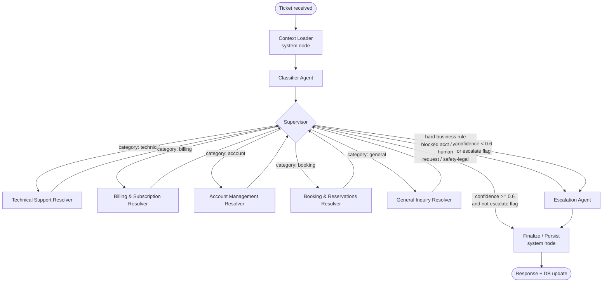

# UDA-Hub Multi-Agent Architecture

This document describes the multi-agent system implemented under `agentic/`. It reflects
what was actually built (see file references throughout), not just the original design plan.

## Pattern

**Supervisor (hub-and-spoke).** A single `supervisor` node is re-entered after every
specialist step and inspects state to decide the next hop via LangGraph's
`add_conditional_edges`. This keeps routing logic centralized, explicit, and easy to trace,
and is one of the standard multi-agent patterns (Supervisor / Hierarchical / Network) called
for by the project rubric.

The graph is a hand-built `StateGraph` (`agentic/workflow.py`) — no
`langgraph.prebuilt.create_react_agent` and no `langgraph_supervisor` anywhere in the
top-level orchestration, so every node, edge, and routing decision is visible in code rather
than delegated to a prebuilt helper.

## Graph diagram



`supervisor_node` (`agentic/agents/supervisor.py`) is the *same function* on both passes: on
first entry (`state["confidence"]` is still unset) it dispatches by `classification.category`
or bypasses straight to Escalation on a hard business-rule flag from the Classifier; on
re-entry (a resolver just ran) it evaluates `confidence` / `escalation_needed` against
`CONFIDENCE_THRESHOLD = 0.6` and routes to Finalize or Escalation. It writes its decision into
`state["route"]`; a paired conditional-edge function (`route_from_supervisor`) just reads that
value back for LangGraph. It is deliberately **rule-based, not an LLM call** — the Classifier
has already been forced (via structured output) to commit to exactly one of five categories,
so there's no remaining ambiguity for an LLM to resolve at the routing step itself.

## Agent roster

| # | Node | Type | Responsibility | File |
|---|------|------|-----------------|------|
| — | Context Loader | deterministic system node | Loads CultPass profile + subscription, UDA-Hub ticket history, and relevant long-term memories before any reasoning happens | `agentic/agents/context_loader.py` |
| 1 | **Classifier** | LLM, no tools | Categorizes the ticket (technical / billing / account / booking / general), estimates urgency/sentiment/complexity, flags repeat issues and hard-escalate cases | `agentic/agents/classifier.py` |
| 2 | **Supervisor** | rule-based router | Central dispatcher — routes to a resolver by category or bypasses to Escalation on a hard business rule; on re-entry, evaluates resolver confidence to decide Finalize vs. Escalation | `agentic/agents/supervisor.py` |
| 3 | **Technical Support Resolver** | LLM + tools | Login/access issues, app bugs | `agentic/agents/resolvers.py` |
| 4 | **Billing & Subscription Resolver** | LLM + tools | Subscription tier/quota/payment, cancel/reactivate/upgrade | `agentic/agents/resolvers.py` |
| 5 | **Account Management Resolver** | LLM + tools | Profile questions, blocked-account questions | `agentic/agents/resolvers.py` |
| 6 | **Booking & Reservations Resolver** | LLM + tools | Book/cancel experience reservations, availability | `agentic/agents/resolvers.py` |
| 7 | **General Inquiry Resolver** | LLM + tools | Catch-all / FAQ | `agentic/agents/resolvers.py` |
| 8 | **Escalation** | LLM | Summarizes the ticket (+ any resolver attempt) and drafts the customer-facing handoff message | `agentic/agents/escalation.py` |
| — | Finalize / Persist | deterministic system node | Writes the final `TicketMessage` + `TicketMetadata` status, saves a resolution summary to long-term memory, flushes the structured trace | `agentic/agents/finalize.py` |

All five resolvers share **one** factory, `create_resolver_node(category, category_instructions,
tool_names)` in `agentic/agents/resolver.py` — same execution shape, different prompt and tool
subset — so the 8-agent graph isn't 8x bespoke code.

### Resolver tool-calling loop

Since `create_react_agent` is off the table, each resolver hand-rolls its own bounded
tool-calling loop:

1. Bind the resolver's allowed tools to the model (`model.bind_tools(...)`).
2. Invoke; if the response has `tool_calls`, execute each one and append the results as
   `ToolMessage`s; repeat (capped at `MAX_TOOL_ITERATIONS = 4`).
3. Once the model stops requesting tools (or the cap is hit), make one final
   `model.with_structured_output(ResolverOutput)` call to produce the answer contract:

```python
class ResolverOutput(BaseModel):
    response: str                       # customer-facing draft
    cited_article_ids: list[str]        # knowledge-base grounding
    confidence: float                   # 0.0-1.0
    escalate: bool
    escalation_reason: str | None
    detected_preference: str | None     # a durable preference the customer stated, if any
```

**Tool identity binding.** A few tools need context (the customer's `external_user_id`, or
the internal `user_id` for memory) that an LLM should never be trusted to supply itself.
`_TOOL_BUILDERS` in `resolver.py` maps each logical tool name to a closure-builder that reads
that context from graph `state` at call time and returns a ready-to-call `StructuredTool` — the
LLM only ever sees the parameters that are actually its choice (`query`, `action`, `tier`,
`experience_id`, ...), never internal ids.

**Confidence guidance** (in every resolver's prompt): ≥0.75 requires direct grounding in a
retrieved knowledge article or a successful tool call; <0.5 with `escalate=True` when no
relevant article was found, a tool call failed, or the request is outside what the resolver can
verify. Supervisor's own threshold for trusting that answer is `confidence >= 0.6`.

**Session history in the prompt.** `agentic/agents/history.py`'s `format_recent_messages(state)`
renders the last few turns of `state["messages"]` as a small transcript, folded into the
Classifier's, every resolver's, and Escalation's prompt (empty string on a first turn, so nothing
changes there). Without this, `state["messages"]` was only ever *stored* by the checkpointer —
never actually read by an agent — so a follow-up like "can you fix the issue we just discussed"
had nothing to resolve "that" against. Live-verified: a two-turn session where turn 2's resolver
prompt genuinely contains turn 1's ticket text and draft response, and the turn 2 reply correctly
references what was raised in turn 1. Covered by `tests/test_workflow_integration.py::
test_same_session_second_turn_depends_on_first_turn` plus per-agent unit tests.

**Preference detection.** A resolver that notices the customer state a durable preference (e.g.
"only contact me by email") fills `detected_preference`; `finalize_node` then calls
`save_customer_memory(internal_user_id, account_id, "preference", ...)` independent of whether
the ticket itself resolved or escalated — a preference is about the customer, not this ticket's
outcome. This is the workflow path that actually *writes* the `"preference"` memory type
`memory_tools.py` already supported but nothing previously produced.

## State schema

`agentic/state.py` — one `TicketState` TypedDict threaded through every node:

```python
messages: Annotated[list[BaseMessage], add_messages]   # short-term/session memory
ticket_id, account_id, external_user_id, channel: str
reported_urgency: str | None
ticket_text: str
user_context: dict            # profile, subscription, past-ticket summaries, long-term memories
classification: Classification
draft_response, cited_article_ids, confidence: ...
escalation_needed: bool
escalation_reason, escalation_summary: str | None
final_status: Literal["resolved", "escalated"]
route: str                    # supervisor's decision, read by the conditional edge
trace: Annotated[list[dict], operator.add]   # append-only audit trail
```

`trace` uses `operator.add` as its reducer (list concatenation) so every node's
`{"trace": [entry]}` return value *appends* to the audit history instead of overwriting it —
the same mechanism `messages` uses via `add_messages`.

## Tools & MCP servers

Business logic lives in plain, typed, unit-tested Python functions under `agentic/tools/`
(`cultpass_tools.py`, `udahub_tools.py`, `knowledge_tools.py`, `memory_tools.py`). Two FastMCP
servers register those functions directly as MCP tools (`mcp.tool(fn)` — no wrapper
boilerplate needed since they're already typed and documented), consumed via
`langchain-mcp-adapters`:

- **`mcp_cultpass_server.py`** (wraps `data/external/cultpass.db`): `get_customer_profile`,
  `get_subscription_status`, `manage_subscription`, `list_reservations`,
  `manage_reservation`, `search_experiences`.
- **`mcp_udahub_server.py`** (wraps `data/core/udahub.db`): `search_knowledge_base`,
  `get_ticket_history`, `update_ticket_record`, `get_internal_user_id`,
  `recall_customer_memory`, `save_customer_memory`.

Every tool returns a structured `{"ok": True, "data": ...}` / `{"ok": False, "error": ...}`
payload and never raises for expected failure cases (unknown id, invalid action, blocked
account, etc.), so a resolver can react to a failure (lower confidence, escalate) instead of
the graph crashing.

Note: the resolver nodes themselves call the plain tool functions directly (via the
`_TOOL_BUILDERS` closures described above), not through the MCP layer — MCP wrapping exists so
tools are usable by MCP-speaking clients generally, and is exercised directly in
`tests/test_mcp_servers.py`.

## Knowledge retrieval (RAG)

Implemented in `agentic/tools/knowledge_tools.py` + `agentic/tools/embeddings.py`:

1. Each `Knowledge` row's `title + content + tags` is embedded once
   (`text-embedding-3-small` via `langchain-openai`) and cached in memory, keyed by
   `account_id` — the KB is effectively static reference content, so re-embedding on every
   search would be wasted latency/cost. `invalidate_knowledge_cache()` forces a refresh after
   edits.
2. A search embeds the query and ranks cached article vectors by cosine similarity
   (`embeddings.rank_by_similarity`) — no vector-store dependency was added; this project's
   corpus (14 articles) doesn't need one.
3. The response includes a `relevant` flag, `True` only when the top match's score is
   `>= RELEVANCE_THRESHOLD (0.35)`. This is deliberately separate from a resolver's own
   self-reported confidence — it's the search tool's own signal that "no genuinely applicable
   article exists," a strong escalation trigger regardless of how confident a drafted answer
   sounds.

**Calibration:** `embed_texts()` accepts an injectable `embed_fn` so every automated test can
use a deterministic fake embedder instead of a live call — no test depends on OpenAI being
reachable. `RELEVANCE_THRESHOLD` was, however, spot-checked against real
`text-embedding-3-small` embeddings over the live 14-article corpus once API access became
available: on-topic queries scored 0.40–0.64 for their correct top article (e.g. "I can't log
in to my account" → *How to Handle Login Issues?* at 0.4552; "How do I get a refund for an
event I missed?" → *Requesting a Refund for a Missed or Cancelled Event* at 0.6357), while a
deliberately off-topic control query ("What's the weather like in Rio de Janeiro?") scored only
0.0741 for its best match. That gap is wide enough that `0.35` reliably separates genuine
matches from noise on this corpus.

## Memory

Three distinct mechanisms, each solving a different requirement:

- **Short-term (session)**: the compiled graph's own checkpointer (`MemorySaver`,
  `agentic/workflow.py`), scoped by `thread_id = ticket_id`. Keeps conversation state during
  one session; inspectable via `orchestrator.get_state_history()`. Actually reaches agent
  *reasoning*, not just storage — see "Session history in the prompt" above.
- **Long-term (cross-session)**: a new `customer_memory` table (`data/models/udahub.py`,
  `CustomerMemory`) — `memory_id, account_id, user_id, memory_type, content, embedding,
  created_at` — keyed by UDA-Hub's *internal* `user_id`, not `thread_id`, so it survives
  across tickets and process restarts. `memory_type` is `"resolution_summary"` (written by
  Finalize on resolution) or `"preference"` (written by Finalize whenever a resolver detects
  one — see "Preference detection" above); both are read by Context Loader and every resolver
  (`recall_customer_memory`). A custom SQLite table was chosen over LangGraph's `InMemoryStore`
  specifically for that restart-durability guarantee. Live-verified cross-session: a preference
  stated on one ticket was recalled by Context Loader on a second, independent ticket for the
  same customer (different `thread_id`) before the Classifier even ran. Covered by
  `tests/test_workflow_integration.py::
  test_cross_session_preference_saved_then_recalled_on_a_different_ticket`.
- **Durable interaction history** (distinct from both): every `TicketMessage` /
  `TicketMetadata` write goes straight to `udahub.db` (`agentic/tools/udahub_tools.py`) — this
  is the system of record for "customer interaction history," independent of LangGraph's own
  checkpointing.

## Logging / tracing

`agentic/tracing.py`'s `log_event()` is called by every node and does two things with each
entry: appends it to `state["trace"]` (in-band, inspectable per-ticket via
`get_state_history()`) and writes it as one JSON line to `logs/uda_hub_trace.jsonl`
(out-of-band, greppable/parseable across all tickets and sessions). Every entry carries
`{timestamp, ticket_id, node, event, ...decision-specific details}`.

**Redaction.** The log is shared and greppable across every ticket, so nothing that could carry
customer data or ticket-specific free text goes into it:
- A resolver's tool calls are logged via `_redact_tool_call()` (`resolver.py`) as
  `{tool, ok, result_count, error_category}` — never the raw call arguments or result payload
  (profile fields, subscription/reservation details, ...). `search_knowledge_base`'s `relevant`
  flag is the one exception kept as-is, since it describes the knowledge base itself, not the
  customer, and is exactly what a retrieval-success-rate metric needs.
- Supervisor's routing `reason` and Escalation's `escalation_reason` can be LLM-authored (a
  classifier's `hard_escalate_reason`, a resolver's own `escalation_reason`) and may narrate
  ticket specifics — both are logged via `tracing.categorize_reason()` as a coarse category
  (`blocked_account`, `low_confidence`, `no_knowledge_match`, ...) instead of the raw string.
  Escalation's `internal_summary` is logged only as `has_internal_summary: bool`.

**Metrics.** `agentic/trace_metrics.py` is a pure query layer over the log: `load_trace_entries()`
+ `compute_metrics()` produce knowledge-retrieval success rate, escalation frequency, and
per-tool call counts/success rates; `format_report()` renders them for a notebook or terminal.
Demonstrated live in `03_agentic_app.ipynb`'s final cell.

## Multi-channel support

`state["channel"]` (e.g. `"chat"`, `"email"`, `"social_media"`) is accepted as ticket
metadata, persisted on `Ticket.channel`, and read by the Classifier for context -- but
resolvers additionally *adapt their draft response's style* to it via `CHANNEL_GUIDANCE`
(`agentic/agents/resolver.py`), appended to every resolver's system prompt at call time:

- `email` — a complete email reply (greeting + sign-off)
- `chat` — short and conversational, no greeting/sign-off
- `social_media` — brief and generic; explicitly instructed to never include
  account-specific details (subscription tier, reservation ids, etc.) in a reply that may be
  publicly visible
- anything else — a sensible default ("keep it clear and appropriately concise")

Live-verified against the real model (same underlying resolver logic and knowledge lookup,
only `channel` varied): the email reply came back with a `Subject:` line, greeting, and
sign-off; the chat reply was two sentences with neither; the social-media reply stayed short
and generic. Covered by `tests/test_resolver.py::test_resolver_prompt_adapts_to_channel`
(parametrized over all four cases) using a `FakeChatModel` that records the actual system
prompt built for each channel.

## Input handling

A ticket's first turn seeds state with `ticket_id`, `account_id`, `external_user_id`,
`channel`, `reported_urgency`, and `ticket_text`. This project's graph resolves-or-escalates a
ticket in one straight-line pass per invocation (classify → route → resolve/escalate →
finalize), so `utils.chat_interface()` treats every line typed as the ticket's current text and
runs it through the whole pipeline again on each turn — `thread_id=ticket_id` still ties every
turn to the same LangGraph session, so short-term memory (message history, already-loaded
context) persists across turns via the checkpointer.

## Testing

Every LLM-calling node (`classifier`, the resolver factory, `escalation`) accepts an injectable
`llm` parameter that defaults to a lazily-constructed real `ChatOpenAI` — the automated suite
passes a `FakeChatModel` (`tests/fakes.py`) that duck-types `bind_tools` / `with_structured_output`
with scripted responses, so it never depends on a live API key. `tests/test_workflow_integration.py`
runs the *real* compiled graph end-to-end (real tool logic, real DB writes, against throwaway
temp databases) with only the LLM calls faked, across seven scenarios: a normal FAQ resolution,
a tool-driven booking, the hard-escalate bypass, a resolver-triggered (low-confidence) escalation,
a same-session multi-turn conversation, and a cross-session preference save/recall.

Separately, once a real API key became available, every one of those scenario *types* was also
run live against the real model and saved in `03_agentic_app.ipynb` — the closest thing to a
production run this project can produce, including the trace-metrics report over that real run's
log.

## Assumptions

- LLM provider is OpenAI (`gpt-4o-mini`), the only LLM dependency installed
  (`langchain-openai`). No `.env` is committed (see repo root `README.md` for required
  variable names); a local `OPENAI_API_KEY` is required to actually run the graph for real.
